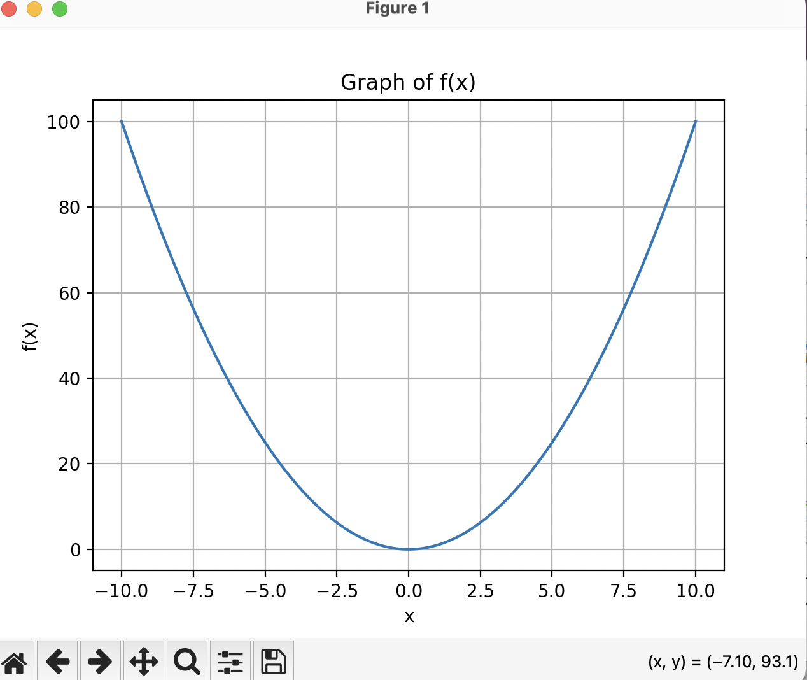

# Graphic Calculator 
#THis is a graphing calculator that will allow for all your functions to be ploted on a graph.
#simply type the function you want, and press enter. A new screen will pop up showing the graph.
#When you hover over the graph, it will show cordinates on the bottom right

## Installation
 

```sh
git clone https://github.com/Hiravp/Graphing-Calculator.git
cd Graphing-Calculator/
```

Build the application using following command

```sh
python3 Graphing\ calc.py

```

Enter a function f(x) input, for example i entered below

```sh
x**2

you will see graph as shown below

    

